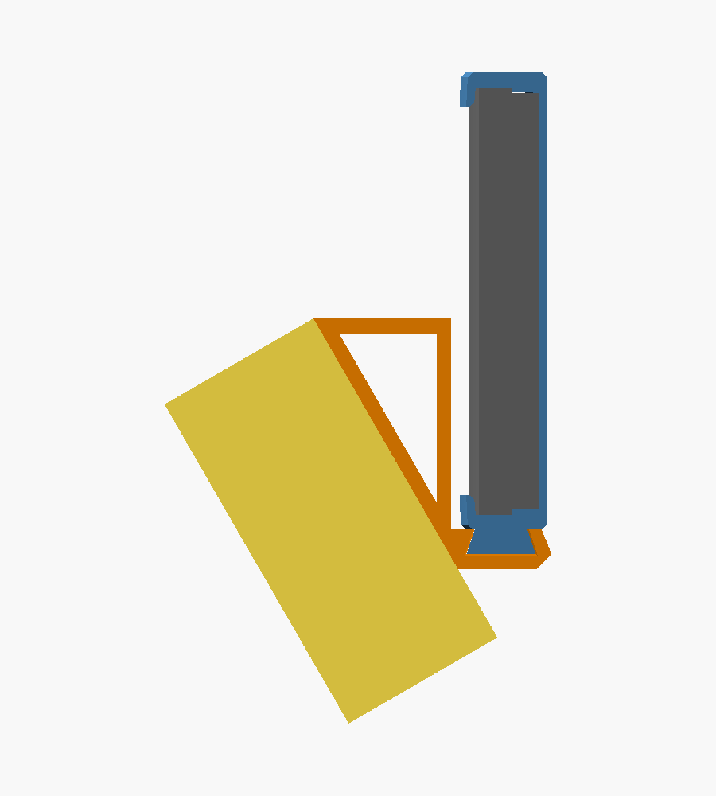
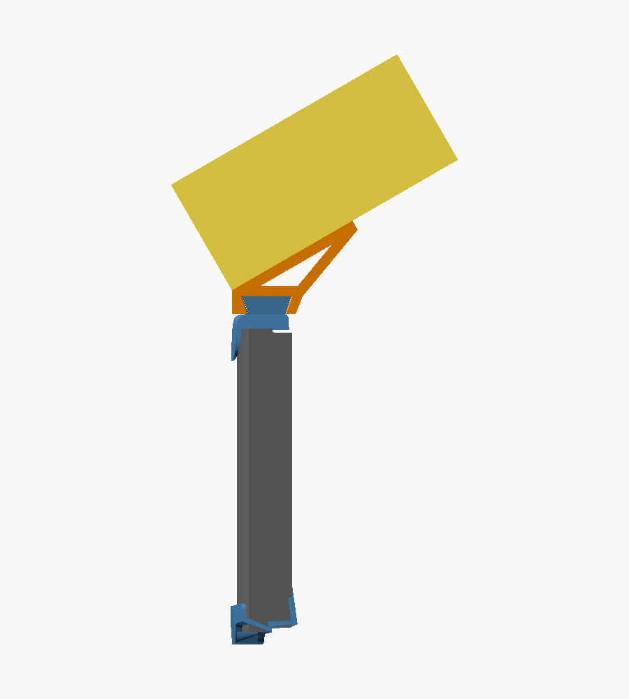
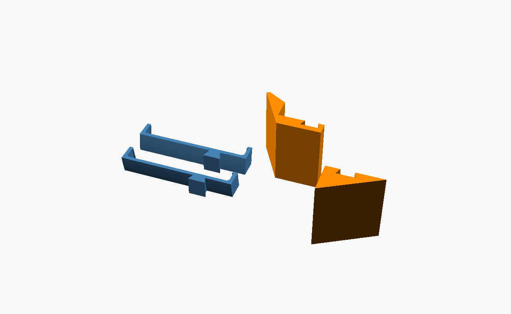

# Steam Frame PD100 Mount

3D-printable mounts that hold a BoboVR PD100 (the PD100 dock with a B100 battery) on the rear battery pod of a Valve Steam Frame. Two mounts share one pair of clip-on arms:

- **Under mount:** hangs the PD100 below and behind the pod. It suits fast-paced games, since there is less movement low on the head.
- **Over mount:** lays the PD100 over the top of the pod at a flat angle. Very little sticks out behind your head, so you can lean back against a headrest.

| Under mount | Over mount |
|---|---|
|  |  |

Side views with the head to the right. The pod is gray, the arms are blue, the mount is orange, and the PD100 is shown as a yellow block.

## Parts



| File | Quantity | Notes |
|---|---|---|
| `stl/under_arm_left.stl` | 1 | Clip-on arm with a dovetail rail across its back |
| `stl/under_arm_right.stl` | 1 | Mirror image of the left arm |
| `stl/under_mount.stl` | 1 | For the under setup |
| `stl/over_mount.stl` | 1 | For the over setup |

Print both arms and whichever mounts you want. The same arms work with either mount.

## Printing

- The STL files are already oriented. Every part prints on its side with no supports, so the layers run in the direction that carries the battery's weight and the arms' flex.
- PETG is recommended. PLA can soften over time from body heat and a warm battery.
- The arms print 15 mm tall and the mounts print 55 mm tall.
- Expect roughly 15 to 20 g for the arms and one mount.

## Assembly

### Under setup

1. Clip the arms onto the pod's outer shell with the rails facing out and on the lower half of the pod. Center each arm about 18 mm to the left or right of the pod's center. Each arm hooks over the top and bottom edges and catches behind the small ledge where the pod's outer shell meets the part that faces your head. The arms flex slightly to snap on.
2. Slide the under mount onto both rails from one side until it is centered.
3. Stick the PD100 to the mount's angled face with 3M Command strips. The PD100's flat bottom goes against the mount, with the display edge toward the pod.

### Over setup

1. Turn both arms upside down so the rails sit on the upper half of the pod, then clip them on. Turning an arm over moves it to the other side, so the left arm now goes on the right.
2. Slide the over mount onto the rails. It also rests on top of the arms.
3. Stick the PD100 to the platform with Command strips, with its display edge at the back of the platform.

The dovetail fit is tight on purpose so the mount stays put by friction. If a mount will not slide on, lightly sand the sides of the rails, or increase `dt_gap` in `cad/common.scad` and reprint the mount.

## Fit and customizing

The design is based on caliper measurements of one Steam Frame and was checked with test prints. The main numbers:

- The pod's outer shell is 87.0 mm tall at the seam, and the part that faces your head is 84.5 mm tall.
- The outer shell is about 6.5 mm thick at the top and bottom edges.
- Seen from above, the pod curves with a radius of about 117.5 mm.

The design is written in OpenSCAD. Settings you are most likely to change:

| File | Setting | What it does |
|---|---|---|
| `cad/pod_dims.scad` | all values | Pod measurements |
| `cad/common.scad` | `curve_radius` | Curve of the pod seen from above |
| `cad/common.scad` | `rim_clearance` | Extra room in the arms' hooks over the pod's edges |
| `cad/common.scad` | `dt_gap` | Dovetail clearance per face |
| `cad/common.scad` | `mount_width`, `arm_offset` | Mount width and arm spacing |
| `cad/under.scad` | `under_tilt` | Angle of the under mount's face, from vertical (30 by default) |
| `cad/under.scad` | `corner_below` | How far below the pod the PD100's front corner may reach. This is the part that can touch your neck when you look up. |
| `cad/over.scad` | `over_tilt` | Angle of the over mount's platform, from vertical (60 by default) |
| `cad/over.scad` | `platform_len` | Platform length from the back of the mount to the tip (40 mm by default) |

## Building the STL files

Use a recent OpenSCAD development snapshot. From the repository folder:

```sh
openscad -D 'part="under_arm_left"'  -D print=true -o stl/under_arm_left.stl  cad/under.scad
openscad -D 'part="under_arm_right"' -D print=true -o stl/under_arm_right.stl cad/under.scad
openscad -D 'part="under_mount"'     -D print=true -o stl/under_mount.stl     cad/under.scad
openscad -D 'part="over_mount"'      -D print=true -o stl/over_mount.stl      cad/over.scad
```

Opening `cad/under.scad` or `cad/over.scad` in OpenSCAD without any settings shows the assembly with the pod and a block the size of the PD100.

## Disclaimer

This project is not affiliated with Valve or BoboVR. It holds a lithium battery on your head, so check the fit and the Command strips before each session, and stop using it if anything cracks or loosens.

## License

MIT. See [LICENSE](LICENSE).
